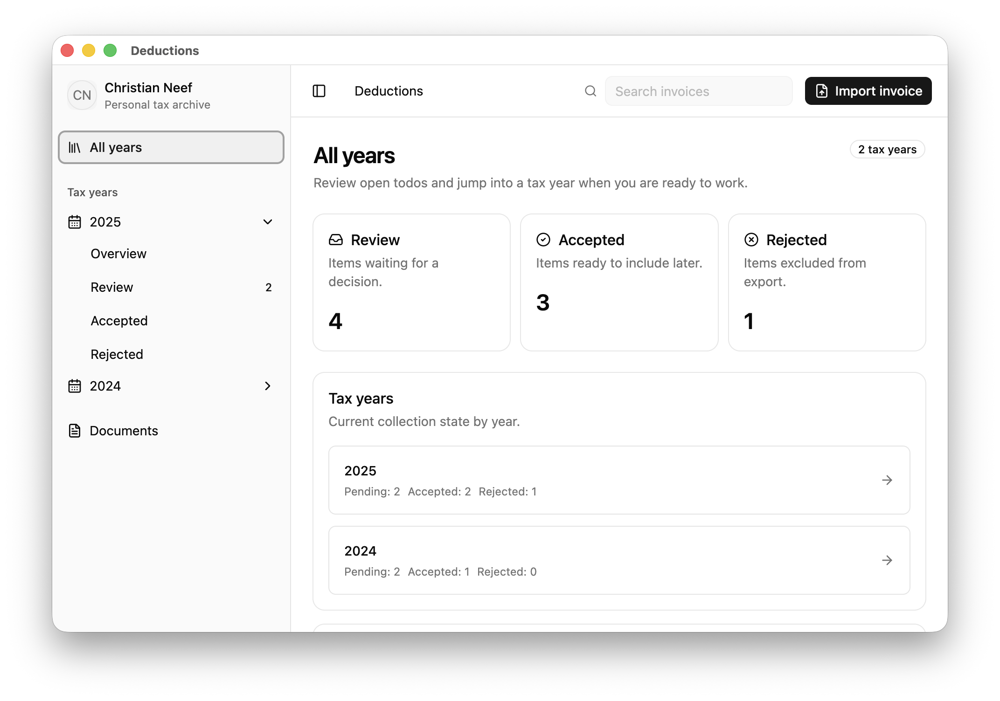

# Deductions

Desktop app for collecting invoices for tax declaration preparation.

## What Deductions Does

Deductions helps people in Germany collect invoices and receipts to save money through income tax deductions.

While you may know that certain expenses can lower your taxable income, the supporting documents are often scattered across email inboxes, online shops, PDFs, photos, local folders, and paper receipts.

Does this sound familiar?

1. You postpone collecting them until close to the tax deadline.
2. You have to remember what was bought and why it was tax-relevant.
3. You search for missing invoices and receipts while under time pressure.
4. Even if a tax consultant files the return, you still have to do the time-consuming work of collecting all the documents.
5. You lose money by missing items or not filing your tax return at all.

The app transforms this task from a late, stressful, memory-based activity into a regular, AI-assisted, money-saving process.

The practical outcome is a clear handover package for tax consultants or individuals preparing their own declarations.



## Build and Run From Scratch

Prerequisites:

- Node.js and npm.
- A local clone of this repository.

Install dependencies:

```bash
npm install
```

Start the app in development:

```bash
npm start
```

Run the standard checks during development:

```bash
npm test
npm run lint
npx tsc --noEmit
```

Package the Electron app locally:

```bash
npm run package
```

Run end-to-end tests:

```bash
npm run test:e2e
```

The end-to-end test command packages the app first through `pretest:e2e`.

## Database Migrations

SQLite schema is defined in TypeScript at `app/main/data/schema.ts`.
Drizzle Kit generates migration files into `app/main/data/drizzle`.

Generate migrations with:

```bash
npm run db:generate
```

This uses `drizzle.config.ts`, which points Drizzle Kit at the schema file and migration output folder.

Generated migration artifacts should be committed as-is:

- `app/main/data/drizzle/*.sql`
- `app/main/data/drizzle/meta/_journal.json`
- `app/main/data/drizzle/meta/*_snapshot.json`

Do not hand-edit generated migration files unless a migration genuinely needs custom SQL. If custom SQL is needed, document why in the migration review.

### Manual Drizzle Command

To manually create the initial migration with the current naming convention from an empty migration folder:

```bash
npx drizzle-kit generate \
  --dialect sqlite \
  --schema ./app/main/data/schema.ts \
  --out ./app/main/data/drizzle \
  --name initial \
  --prefix index
```

After generating migrations, run:

```bash
npx tsc --noEmit
npm test
npm run lint
```
