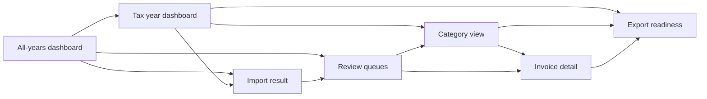
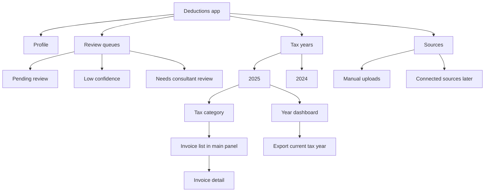

# Main UI Plan

## Purpose

Plan the first real application shell for Deductions: a two-panel desktop UI with a left sidebar for tax-year navigation and a main content area for dashboards, invoice lists, and invoice review.

This document is a design plan only. It does not define implementation tasks yet.

## Inspiration To Reuse

Use the shadcn New York v4 `sidebar-07` pattern as structural inspiration, not as a direct content model.

Relevant ideas:

- Collapsible left sidebar that can reduce to an icon rail.
- Main `SidebarInset` style content area.
- Header row with sidebar trigger, separator, breadcrumb, and right-side actions.
- Grouped sidebar content.
- User menu pattern.

Sources:

- https://ui.shadcn.com/view/new-york-v4/sidebar-07
- https://ui.shadcn.com/blocks/sidebar
- https://ui.shadcn.com/docs/components/radix/sidebar

## Recommended Layout

```text
+------------------------------+-------------------------------------------------+
| Sidebar                      | Main content                                    |
|                              | +---------------------------------------------+ |
| Profile                      | | Main header                                 | |
|  CN  Christian Neef          | | [toggle] Deductions / 2025 / Work-related   | |
|                              | |                    [Search] [Import invoice]| |
|                              | +---------------------------------------------+ |
| Review queues                |                                                 |
|  Pending review        18    | Selection-dependent view                         |
|  Low confidence         6    |                                                 |
|  Consultant review      3    | All-years dashboard                             |
|                              | Tax-year dashboard                               |
| Tax years                    | Category review list                             |
|  v 2025                42    | Invoice detail and document viewer               |
|    Dashboard                 | Import result view                               |
|    Work-related        12    | Export readiness view                            |
|    Special expenses     5    |                                                 |
|    Household services   2    |                                                 |
|    Not tax-relevant     8    |                                                 |
|  > 2024                91    |                                                 |
|                              |                                                 |
| Sources                      |                                                 |
|  Manual uploads              |                                                 |
|  Connected sources           |                                                 |
+------------------------------+-------------------------------------------------+
```

## Navigation Model

The sidebar should combine task shortcuts and archive hierarchy.

Primary sidebar regions:

1. Profile.
2. Review queues.
3. Tax years.
4. Sources.

The tax-year tree should stop at category by default. Individual invoices should not become the canonical sidebar list. The sidebar may show the currently selected invoice or a small set of recent/active invoices as contextual affordances, but invoice selection should happen primarily in the main panel.

Users select individual invoices through:

- Category invoice tables in the main panel.
- Review queue lists, such as pending review or low confidence.
- Search results.
- Recent imports after an import batch.
- Dashboard widgets that link into filtered invoice lists.

This keeps the sidebar stable while still allowing drill-down from year to category to individual invoice.

Recommended hierarchy:

```text
Profile
Review queues
  Pending review
  Low confidence
  Needs consultant review
Tax years
  2025
    Dashboard
    Work-related expenses
    Special expenses
    Extraordinary burdens
    Household services
    Tradesperson services
    Not tax-relevant
  2024
Sources
  Manual uploads
  Connected sources
```

## Main Content Views

### All-Years Dashboard

Shown when the app opens and no specific year is selected.

Purpose:

- Explain overall collection state across years.
- Surface the most urgent review queues.
- Show recent imports and export readiness.

Content:

- Tax-year summary cards.
- Open review queue counts.
- Recent imports.
- Source health once automated sources exist.
- Primary action: `Import invoice`.

### Tax-Year Dashboard

Shown when a tax year is selected.

Purpose:

- Help the user understand the state of one tax year.
- Make pending work obvious.
- Support both catch-up and regular review.

Content:

- Counts by status and flag: pending, accepted, rejected, consultant review.
- Counts by category.
- Monthly collection coverage.
- Low-confidence extraction summary.
- Export readiness warning if accepted items are missing required data.
- Actions: `Import invoice`, `Review pending`, `Export`.

The export action belongs in the tax-year dashboard because export is currently a tax-year-specific action. The app does not need a persistent "export packages" area yet; generated packages should be saved by the user outside the app.

### Category View

Shown when a tax category is selected.

Purpose:

- Let users process invoices in a focused category.
- Support sorting and batch review.

Content:

- Invoice table with vendor, date, amount, status, confidence, source, and notes indicator.
- Filters for status, month, source, and confidence.
- Category-level explanation in conservative language, for example "Items here may be relevant as work-related expenses."
- Batch actions for accept, reject, flag for consultant, and move category.

### Invoice Detail View

Shown when an individual invoice is selected.

Purpose:

- Put the original evidence next to extracted facts and review decisions.

Recommended layout:

```text
+------------------------------------------------+-----------------------------+
| Document viewer                                | Review panel                |
|                                                |                             |
| PDF/image preview                              | Status                      |
| zoom, page controls                            | Category                    |
|                                                | Suggested reason            |
|                                                | Extracted fields            |
|                                                | Confidence and provenance   |
|                                                | User note                   |
|                                                | Actions                     |
+------------------------------------------------+-----------------------------+
```

Key behavior:

- Show extracted facts separately from AI suggestions.
- Mark user-confirmed fields.
- Keep original document visible while editing metadata.
- Preserve uncertainty instead of forcing a binary accepted/rejected decision.
- Treat "needs consultant review" as a flag, not a mutually exclusive status. An invoice can be pending, accepted, or rejected while still being flagged for consultant review.

### Import Result View

Shown after importing documents.

Purpose:

- Make batch import understandable and reversible.

Content:

- Accepted, skipped, failed, duplicate, and rejected counts.
- Document list grouped by outcome.
- Next action: `Review imported invoices`.
- Failure reasons where available.

## UI Flow Diagram



## Information Architecture Diagram



## Header Behavior

The main header should be persistent and should be part of the main content inset, matching the `sidebar-07` structure. It should not span across the sidebar.

Reasoning:

- The sidebar already has its own profile header.
- Breadcrumbs describe the main content selection, so they should live inside the main content region.
- When the sidebar collapses to an icon rail or becomes an off-canvas drawer, the main header remains stable.
- This keeps the layout aligned with shadcn's `SidebarInset` pattern and avoids making the sidebar feel subordinate to a global app bar.

Left side:

- Sidebar toggle icon.
- Breadcrumb navigation.

Right side:

- Search, once search exists.
- `Import invoice` button.
- Optional overflow menu for export/settings later.

Breadcrumb examples:

- `Deductions`
- `Deductions / 2025`
- `Deductions / 2025 / Work-related expenses`
- `Deductions / 2025 / Work-related expenses / Apple Store invoice`

Breadcrumbs should communicate location and allow upward navigation. They should not replace the sidebar tree or review queues.

## Sidebar Behavior

Expanded sidebar:

- Width around 280 to 320 px.
- Scrollable content between sticky top profile and optional bottom settings/help area.
- Badges for counts and status.
- Disclosure controls for years and categories.

Collapsed sidebar:

- Icon rail.
- Tooltips for each icon.
- Preserve key actions: dashboard, review queues, tax years, and sources.
- Avoid rendering invoice-level labels in collapsed state.

Mobile or narrow window:

- Sidebar becomes an off-canvas drawer.
- Header keeps the sidebar trigger and import button.
- Invoice detail should stack document viewer above review panel.

## Visual Priorities

The UI should feel like a work tool, not a marketing page.

Recommended style:

- Quiet neutral background.
- Clear table density for invoice review.
- Small count badges in sidebar.
- Status colors used sparingly and consistently.
- Icons for repeated navigation items and actions.
- No decorative cards inside cards.

Important status vocabulary:

- Pending review.
- Accepted.
- Rejected.
- Low confidence.
- Export issue.

Important flags:

- Needs consultant review.

Review queues should contain open todos only: pending review, low-confidence items, consultant-review items, and export issues if they require user action. Rejected and not-tax-relevant invoices should stay visible through the relevant tax-year and category views because they are current decisions, not active todos. `Not tax-relevant` should remain a category under each tax year.

## Data Shown By Level

| Selected level | Main user question                       | Main view                             |
| -------------- | ---------------------------------------- | ------------------------------------- |
| All years      | "What needs attention overall?"          | Cross-year dashboard                  |
| Tax year       | "How ready is this year?"                | Year dashboard                        |
| Category       | "Which invoices are in this bucket?"     | Filterable invoice table              |
| Invoice        | "Is this document correctly understood?" | Document viewer plus review panel     |
| Review queue   | "What should I process next?"            | Filtered invoice list                 |
| Import result  | "What happened to my files?"             | Import summary and next steps         |
| Export         | "Can I hand this tax year over?"         | Tax-year export action and validation |

## Improvements To The Original Proposal

1. Keep the two-panel layout, but make the sidebar a navigation and queue surface rather than the place where every invoice lives.
2. Put `Import invoice` in the header as a global primary action.
3. Add review queues above the year hierarchy because they match the user's real work.
4. Use category-level navigation for tax browsing, then use main-panel lists for invoice density.
5. Treat breadcrumbs as orientation and upward navigation, not as the main drill-down mechanism.
6. Make uncertainty and review state first-class in both sidebar counts and main views.
7. Keep profile compact and personal; do not introduce workspace or tax-context concepts before the product needs them.
8. Put export on the tax-year dashboard rather than creating a separate stored export-package area.

## First Implementation Slice For This UI

When implementation begins, the first slice should be a static, data-backed shell with mocked invoice data. It should prove navigation and layout before connecting real parsing or persistence.

Suggested scope:

- App shell with collapsible sidebar and persistent header.
- Mock user profile.
- Mock tax years, categories, invoices, and review statuses.
- All-years dashboard.
- Tax-year dashboard.
- Category invoice table.
- Invoice detail shell with placeholder document viewer.
- Import button wired only to the existing native file picker or to a placeholder route, depending on the implementation phase.

Out of scope for the first UI slice:

- Real invoice extraction.
- Real tax categorization.
- Real PDF rendering.
- Export package generation.
- Source integrations.

## Final Decisions

1. Tax categories are fixed from the product taxonomy for the first UI slice. They should be represented as data so they can become editable later without changing the navigation model.
2. The sidebar should not show invoice lists by default. It may show only the currently selected invoice or a very small recent/active invoice affordance if needed for orientation.
3. Selecting an invoice from a category table, review queue, search result, or import result opens invoice detail in the main content area for the first implementation slice.
4. A quick review panel is a separate design problem. The first UI slice should not implement it, but the layout should leave room for it to appear later as a focused review workflow over open todos.

The review panel interaction needs its own design document. It may become the main fast-review workflow for open todos, especially pending review and low-confidence items.

## Recommendation

Proceed with the two-panel shell, but bias it toward workflow queues plus year/category navigation. The user should be able to drill down naturally, but the UI should also answer "what should I review next?" and "is this tax year ready to export?" without forcing the user to browse every category manually.
